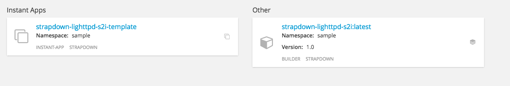

== Strapdown Lighttpd S2I for OpenShift - Docker image

This repository contains sample builder image to be used with
link:https://github.com/openshift/source-to-image[source-to-image] in
link:https://github.com/openshift/origin/[OpenShift].

This image is to enable link:http://strapdownjs.com/[Strapdown] running on link:https://www.lighttpd.net/[lighttpd]

== Configuration
This image will use 2 BuildConfig Environment options for customization:

- *TITLE*: The title to provide to the generated site.
- *THEME*: The theme to use from this link:assets/themes[list of themes]. Or you can provide your own with your source code in the same folder structure (assets/themes) 

== Installing

----
oc create -f https://raw.githubusercontent.com/jorgemoralespou/strapdown-lighttpd-s2i/master/ose3/strapdown-lighttpd-s2i.json
----

This will build the s2i builder (strapdown-lighttpd-s2i), and will provide a template (strapdown-lighttpd-s2i) for usage.

Once the strapdown image has been built, you can use either the s2i builder image directly or a strapdown-lighttpd-s2i-template

